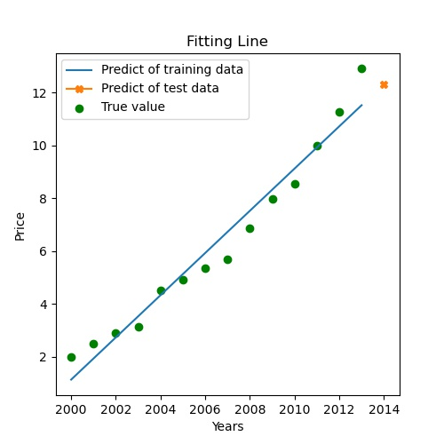

# NJUST机器学习课后作业python实现
- ## 感知机
### I.以两门考试成绩数据集进行二分类，Mini_batch梯度下降
### 因为梯度下降会遇到局部极小值点，所以用了Adam算法，因为数据集线性不可分，所以最后不能收敛

### II.使用Multiclass感知机以两门考试成绩数据集进行二分类，Mini_batch梯度下降
### 与以上相似

### II.使用Multiclass感知机以鸢尾花数据集进行三分类，Mini_batch梯度下降，使用了Adam算法

- ## softmax回归
### 用鸢尾花数据集对3种鸢尾花分类
### I.Softmax回归梯度下降可视化结果

### II.Softmax回归随机梯度下降可视化结果

- ## 逻辑回归
### 以两门考试成绩数据集对过和不过的情况进行分类
###  I.逻辑回归梯度下降可视化结果

### II.逻辑回归随机梯度下降可视化结果

### III.逻辑回归牛顿法优化可视化结果

- ## 线性回归
### 以2010-2013年的房价为训练集，预测2014年房价
### I.线性回归最小二乘法优化可视化结果

### II.线性回归梯度下降可视化结果

